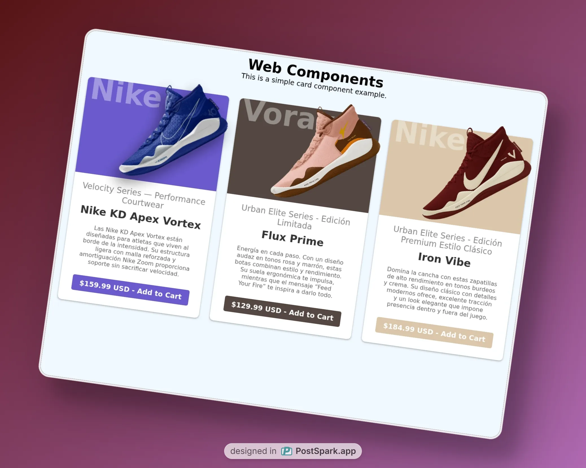
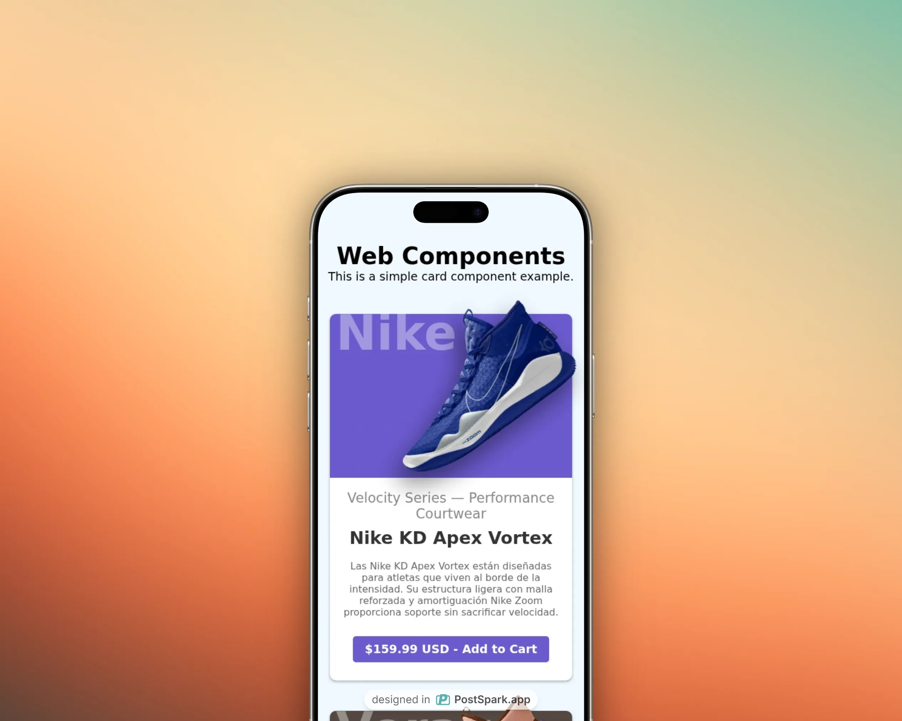

# Card Component

Componente web reutilizable para mostrar productos en formato de tarjeta, ideal para catálogos, tiendas online o galerías de productos.

## Preview




## Descripción

`card-component` es un Web Component personalizado que permite mostrar información de productos de manera visual y atractiva. Incluye marca, imagen, categoría, nombre, descripción, precio y un botón de acción.

## Instalación

1. Clona este repositorio o copia los archivos necesarios a tu proyecto:

```bash
git clone <url-del-repo> # o descarga los archivos manualmente
```

2. Asegúrate de tener la siguiente estructura de archivos:

```
components/
  card-component.js
assets/
  nike-blue.webp
  nike-brown.png
  nike-pink.png
index.html
style.css
```

3. Importa el componente en tu HTML:

```html
<script type="module" src="./components/card-component.js"></script>
```

## Uso

Ejemplo de uso en HTML:

```html
<card-component
  product_brand="Nike"
  img="./assets/nike-blue.webp"
  alt_img="Nike KD Apex Vortex"
  product_category="Velocity Series — Performance Courtwear"
  product_name="Nike KD Apex Vortex"
  product_description="Las Nike KD Apex Vortex están diseñadas para atletas que viven al borde de la intensidad. Su estructura ligera con malla reforzada y amortiguación Nike Zoom proporciona soporte sin sacrificar velocidad."
  product_price="$159.99 USD"
></card-component>
```

## Props / Atributos

| Atributo              | Descripción                      |
| --------------------- | -------------------------------- |
| `product_brand`       | Marca del producto               |
| `img`                 | URL de la imagen principal       |
| `alt_img`             | Texto alternativo para la imagen |
| `product_category`    | Categoría o línea del producto   |
| `product_name`        | Nombre del producto              |
| `product_description` | Descripción breve del producto   |
| `product_price`       | Precio del producto              |

## Tecnologías usadas

- [Web Components](https://developer.mozilla.org/es/docs/Web/Web_Components)
- [JavaScript](https://developer.mozilla.org/es/docs/Web/JavaScript)
- [CSS](https://developer.mozilla.org/es/docs/Web/CSS)

## Autor

- [Edwin Contreras](https://github.com/EdGonzz)

## Licencia

Este proyecto está bajo la licencia MIT. Consulta el archivo [LICENSE](./LICENSE) para más detalles.
